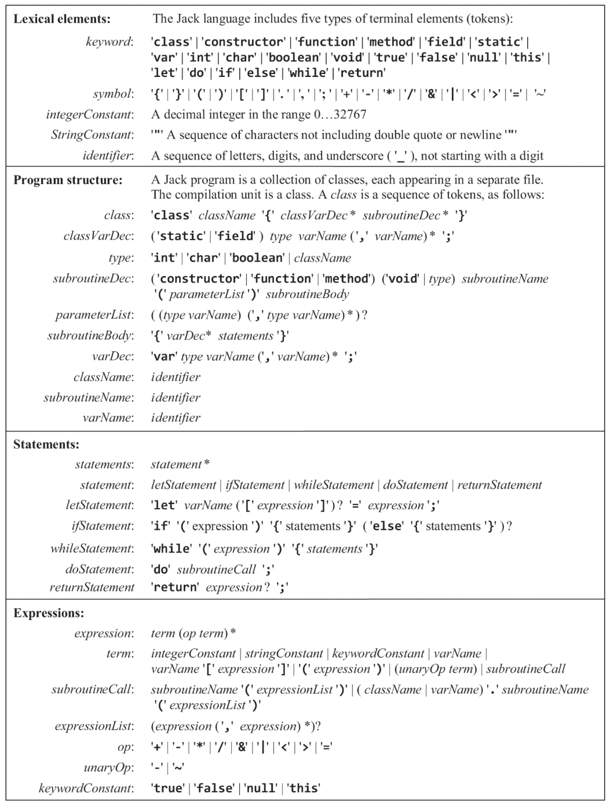

# jack-compiler

A two-stage compiler for the Jack programming language written in Python, built as part of the [Nand2Tetris](https://www.nand2tetris.org/) course (Projects 10 & 11).

Compiles `.jack` files written in the Jack programming language into `.vm` files for the Hack virtual machine. Supports both single-file and multi-file (directory) compilation.

## Usage

```bash
python compiler.py <file.jack>        # single file
python compiler.py <directory>        # directory of .jack files
```

The output `.vm` file will be created in the same directory as the input.

## Examples

```bash
python compiler.py Square             # produces Main.vm, Square.vm, SquareGame.vm
python compiler.py Main.jack          # produces Main.vm
```

## Supported Language Features

**Types:** `int`, `char`, `boolean`, class types 

**Subroutines:** `function`, `method`, `constructor` (including `void` return type)

**Statements:** `let`, `if`, `if-else`, `while`, `do`, `return`

**Expressions:**
- Arithmetic: `+`, `-`, `*`, `/`, unary `-`
- Relational: `=`, `<`, `>`
- Logical: `&`, `|`, `~`
- Array access: `arr[expression]`
- Subroutine calls: `Class.function()`, `obj.method()`, `method()` (implicit call on `this`)
- Constants: integer literals, string literals, `true`, `false`, `null`, `this`

**Scoping:** class-level (`static`, `field`) and subroutine-level (`var`, `arg`) scope shadowing

## The Jack Grammar



*Source: Nisan & Schocken, The Elements of Computing Systems, 2nd ed. MIT Press (2021), Figure 10.5.*

## Project Structure

```
jack-compiler/
├── compiler.py       # Main entry point
├── comp_engine.py    # Recursive-descent parser and VM code generator
├── tokenizer.py      # Handles lexical analysis
├── symbol_table.py   # Manages symbol tables
├── code_writer.py    # Writes VM commands to output file
├── errors.py         # JackSyntaxError exception
└── examples/
```
