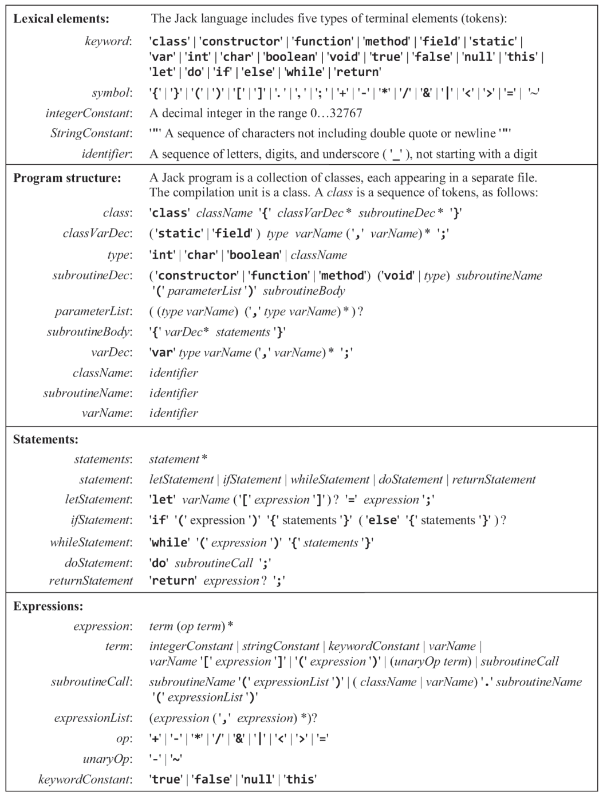

# jack-compiler

A compiler for the Jack programming language written in Python, built as part of the [Nand2Tetris](https://www.nand2tetris.org/) course (Projects 10 & 11).

Compiles `.jack` files written in the Jack programming language into `.vm` files for the Hack virtual machine. Supports both single-file and multi-file (directory) compilation.

This compiler is part of a complete computing system built from scratch:

| Project | Description |
|---|---|
| [hack-computer](https://github.com/j0klar/hack-computer) | ALU, CPU, and memory chips in HDL |
| [hack-assembler](https://github.com/j0klar/hack-assembler) | Two-pass assembler with symbol resolution |
| [vm-translator](https://github.com/j0klar/vm-translator) | Stack-based VM translator (compiler backend) |
| [jack-compiler](https://github.com/j0klar/jack-compiler) | ← you are here |
| [jack-os](https://github.com/j0klar/jack-os) | Jack OS standard/runtime library |

To experience all layers of the hardware & software architecture, start by compiling all [OS files](https://github.com/j0klar/jack-os) together with any number of `.jack` files in the same directory using the [Jack compiler](https://github.com/j0klar/jack-compiler). Then, translate the resulting `.vm` directory via the [VM translator](https://github.com/j0klar/vm-translator) and assemble the resulting `.asm` file using the [Hack assembler](https://github.com/j0klar/hack-assembler). Finally, run the resulting `.hack` binary file either directly on a hardware realization of the [Hack computer](https://github.com/j0klar/hack-computer), or online on the Nand2Tetris [CPU Emulator](https://nand2tetris.github.io/web-ide/cpu). In case of performance issues, it is recommended to use the desktop version of the CPU Emulator instead, which can be downloaded [here](https://www.nand2tetris.org/software).


## Usage

```bash
python compiler.py <file.jack>        # single file
python compiler.py <directory>        # directory of .jack files
```

The output `.vm` file will be created in the same directory as the input.


## Examples

```bash
python compiler.py Main.jack          # produces Main.vm
python compiler.py Pong/              # produces Main.vm, Ball.vm, PongGame.vm, ...
```

The `Pong/` folder contains `.jack` files for a simple pong game and the [Jack OS](https://github.com/j0klar/jack-os), serving as an example to demonstrate the compilation pipeline described above.


## Supported Language Features

**Types:** `int`, `char`, `boolean`, class types 

**Subroutines:** `function`, `method`, `constructor` (including `void` return type)

**Statements:** `let`, `if`, `if-else`, `while`, `do`, `return`

**Expressions:**
- Arithmetic: `+`, `-`, `*`, `/`, unary `-`
- Relational: `=`, `<`, `>`
- Logical: `&`, `|`, `~`
- Array access: `arr[expression]`
- Subroutine calls: `Class.function()`, `obj.method()`, `method()` (implicit call on `this`)
- Constants: integer literals, string literals, `true`, `false`, `null`, `this`

**Scoping:** class-level (`static`, `field`) and subroutine-level (`var`, `arg`) scope shadowing


## The Jack Grammar



*Source: Nisan & Schocken, The Elements of Computing Systems, 2nd ed. MIT Press (2021), Figure 10.5.*


## Project Structure

```
jack-compiler/
├── compiler.py       # Main entry point
├── comp_engine.py    # Recursive-descent parser and VM code generator
├── tokenizer.py      # Handles lexical analysis
├── symbol_table.py   # Manages symbol tables
├── code_writer.py    # Writes VM commands to output file
├── errors.py         # JackSyntaxError exception
├── jack-grammar.png  # Jack grammar specification
└── Pong/
```